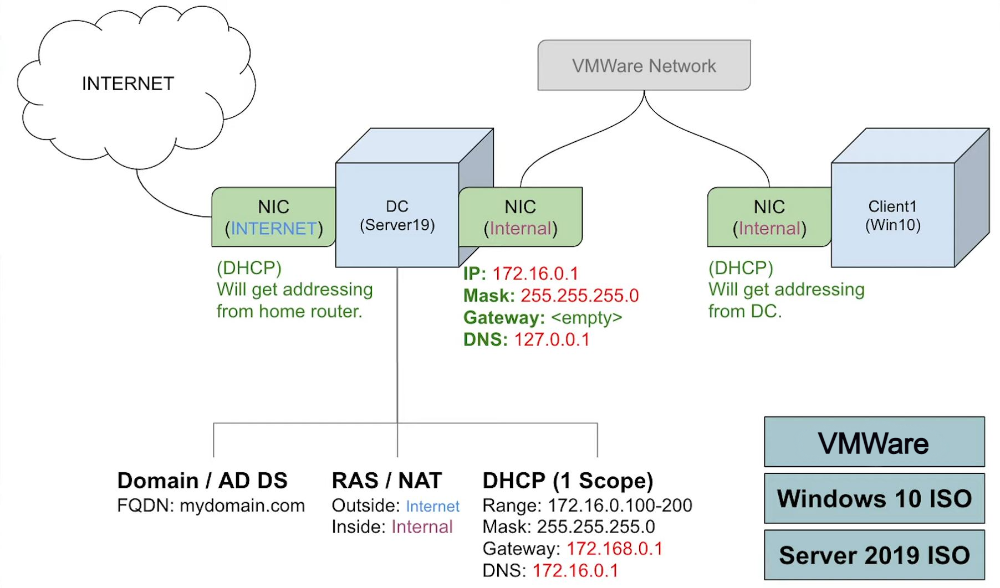

# Home-Lab
<h1>Basic Virtual Machine and Active Directory Home Lab Set up</h1>

<h2>Description</h2>
<b>I made this project to serve as a general walkthrough for people to set up Actice Directory, DNS, DHCP, NAT and RAS in an emulated enterprise setting!</b>

<h2>Utilities a& Services Used and Created</h2>
 - Powershell  
 - Server Manager 
 - Active Directory 
 - DNS 
 - DHCP 
 - NAT 
 - RAS 

<h2>Environments and Tools Used</h2>
 Oracle VM VirtualBox: https://www.virtualbox.org/wiki/Downloads 
 Microsoft Server 2019: https://www.microsoft.com/en-us/evalcenter/download-windows-server-2019 
 Microsoft Windows 10 ISO: https://www.microsoft.com/en-us/software-download/windows10 

<h2 align="center">Setup walkthrough</h2>

<b>For this setup, we will be using this network diagram:<b>

<b>and utilizing VMware to create virtual setup of a Windows Server 2019 connecting to and managing a Windows 10 client. To start, download the Oracle VM VirtualBox, Microsoft Server 2019 ISO, and Microsoft Windows 10 ISO from the links under "Environments and Tools Used</h2>.
 

 Note: to obtain the Windows 10 ISO file, it's usually a little trickier than simply downloading it. you must first download the Windows 10 Media Creation Tool from the provided link (often called: "MediaCreationTool22H2.exe"). 

After running the Media Creation file, you will be presented with the option to Upgrade your Windows or create an installation media. Click on "create an installation media" option.

Then click on "ISO file" to create your Windows 10 ISO image file.

Now you have all your files:

 

