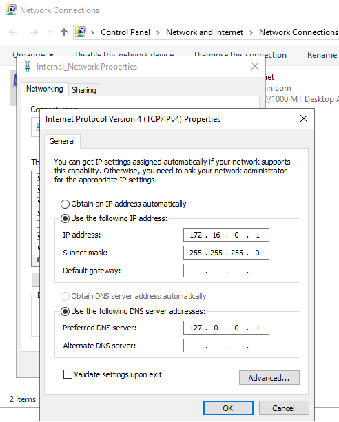

<h1>Basic Virtual Machine and Active Directory Home Lab Set up</h1>

<h2>Description</h2>
<b>I made this project to serve as a general walkthrough for people to set up Actice Directory, DNS, DHCP, NAT and RAS in an emulated enterprise setting!</b>

<h2>Utilities & Services Used and Created</h2>
 - Powershell  
 - Server Manager 
 - Active Directory 
 - DNS 
 - DHCP 
 - NAT 
 - RAS 

<h2>Environments and Tools Used</h2>
 Oracle VM VirtualBox: https://www.virtualbox.org/wiki/Downloads 
 Microsoft Server 2019: https://www.microsoft.com/en-us/evalcenter/download-windows-server-2019 
 Microsoft Windows 10 ISO: https://www.microsoft.com/en-us/software-download/windows10 

<h2 align="center">Virtual Machine Setup Walkthrough</h2>

<b>For this setup, we will be using this network diagram:<b>

<b>Our first virtual machine will the the Server. It will house two network adapters, one for connecting to the outside interent and the other for conenction to the virtual box's private network that the clients will connect to. Note that the external network will gain automatic addressing from our home network but we will need to assign an IP address to the internal network which we'll take care of shortly. Once having done so, we will install services such as Active Directory, DNS, DHCP, etc. and then lastly configure the Windows 10 client image to connect to the server image!</b>

 <b>In short, We will be utilizing VMware to create virtual setup of a Windows Server 2019 connecting to and managing a Windows 10 client. To start, download the Oracle VM VirtualBox, Microsoft Server 2019 ISO, and Microsoft Windows 10 ISO from the links under "Environments and Tools Used</b>.

 Note: to obtain the Windows 10 ISO file, it's usually a little trickier than simply downloading it. You must first download the Windows 10 Media Creation Tool from the provided link (often called: "MediaCreationTool22H2.exe"). 

 

 

<b>After running the Media Creation file, you will be presented with the option to Upgrade your Windows or create an installation media. Click on "create an installation media" option.</b>

Then click on "ISO file" to create your Windows 10 ISO image file.

<b>Now you have all your files:</b>

 

<b>Once we have installed all the ISO files installed, appointing the Windows 10 ISO to "SeperClientLab" and Windows 2019 Server ISO to "SeperServerLab" it should look a little something like this:<b>

<b>Use the respective ISO files to create the base Server 2019 and Windows 10 virtual machines!</b>

<h2 align="center">Server Configuration Walkthrough</h2>

<b>We'll start off with setting up the Server first. Click on the Server's settings tab and navigate to "Adaptor 2". Click "Enable Network Adapter" and make it attached to the internal network "intnet" as shown below:</b>

<b>This creates an internal network to attach to the NAT network that's configured in Adapter 1. Now load the Server ISO image to boot the virtual server!</b>

<b>First order of business is to set up the internet by configuring the two network adapters. One is for the internal NIC and the other for the external so we'll have to configure them. Navigate to Network Settings and click on "Change adapter options."</b>

<b>Once there, you will have two network options. One will be the external and other for the internal networks but you will have to configure these as such.</b>

<b>Right click on the network that's assigned to the internal network and click on "Properties." Then double click on "Internet Protocol Version 4 (TCP/IPv4)" to configure it. Based on our Network Diagram, configure the IP address, Subnet mask, and DNS server address.</b>

<b>In this virtual environment, the Domain Controller will act as our default gateway, so we do not need to add a default gateway address. And for the DNS server, I assigned it to a loopback address so that it will ping itself.</b>

<b>For our convenience, we will now rename these networks to Main_Internet and Internal_Internet.<b>

<b>And for further convenience, we can rename our system to something like "DomainControllerName" and then restart.

 Once restarted, open Server Manager and click on "Add roles and features" 

and by following this short clip, install the "Active Directory Users and Computers", "DHCP", "DNS", and "Remote Access"!

https://github.com/seperdan/Home-Lab/assets/54723844/8d63997c-72d5-421b-a6a4-d504b36dba4a

<b>Installing these services will take a few minutes. Once this is done, we we will need to create a Domain to go with the Active Directory Domain Services (AD DS) we just set up.</b>

https://github.com/seperdan/Home-Lab/assets/54723844/7384b2bb-f567-4002-92fe-1c6c85e7644d

<b>Once the installation finishes, the system will restart again and will do some configurations over the next few minutes. Once the system reloads, you might notice that the login name has seen a change:</b>

<b>Next, navigate to Active Directory Users and Computers either through using the Windows search. Then right click on your domain, create a new Organizationl Unit (OU), name it something like "_ADMIN", right click on the new OU to create a new user with your credentials. This user will serve as the domain administrator!</b>

https://github.com/seperdan/Home-Lab/assets/54723844/476cb34b-eb85-4b69-a271-e8cd334ba068

<b>Note: You can similarly find Active Directory Users and Computers by clicking on "Tools" and then selecting "Active Directory Users and Computers" on the Server Manager tool like so:</b>

<b>Even though we've created our user as the domain administrator, we haven't given it admin premissions yet. We can do this by following these steps:</b>

https://github.com/seperdan/Home-Lab/assets/54723844/5c398a79-3990-4fdc-a5e5-6b3ddd491bdd

<b>After having done so, we can sign out of the built-in admin account and sign into the newly-created domain admin account:</b>

https://github.com/seperdan/Home-Lab/assets/54723844/39a79a87-e9e5-4008-b4a3-c2f95c2d293d

<b>Now in your newly-created local admin account, we use "Tools->Routing and Remote Access" to configure the RAS and NAT to be able to connect to the internet.

https://github.com/seperdan/Home-Lab/assets/54723844/df9e007c-14eb-4c75-bce6-f6d3690ec0e5

<b>*Note: Sometimes the network interface that you need, in this case "Main_Internet" will be greyed out when setting up the Rotuing and Remote Access server. The solution for this is to exit the installation wizard and try again. Make sure to select the main internet network interace instead of the internal internet!</b>

<b>Now you will have this when you navigate to Routing and Remote Access!</b>

<b>Now it's time to setup the DHCP and its scope!</b>

https://github.com/seperdan/Home-Lab/assets/54723844/6a3c57a5-e39b-4e27-b84c-1782757150a8

<b>The scope I will be creating will give assign IP addresses in the range of 172.16.0.100 to 172.16.0.200. This means that the DHCP will assign 100 different IP addresses. I also set the amount of time the IP addresses can be leased out to 100 days just for convenience as this is only a VM and the lease duration doesn't matter.

<b>After having done so, you may need to authorize and refresh the domain so that the IPv4 checkmark turns green and the scope becomes usable</b>

<b>Now it's time to add some users using a Powershell file that has over a 1000 pre-made randomized users! I am using a script that I was able to find on the internet: https://www.youtube.com/redirect?event=video_description&redir_token=QUFFLUhqbmMycXJONmJJTmRQYzgyTDA5Y2M3Y1BZZnQxQXxBQ3Jtc0trbmYzZEZFcEc2V2IzS1pHN2xXMFdWUDFNWVBwdlVBX1FzNlNLUHMySm8xT01QUWRHbEZuZS1uWDJfYm1wbGlhclBjYTdidExVUGdKclFXSmN0ZW0tSlBGSk5pc2Vmb1dEM3N4YzdZNmFpQ3ZIX0R6Yw&q=https%3A%2F%2Fgithub.com%2Fjoshmadakor1%2FAD_PS%2Farchive%2Frefs%2Fheads%2Fmaster.zip&v=MHsI8hJmggI</b>

<b>The folder will have the following files:</b>

<b>Once you've downloaded the file, extract it and add your name to the names.txt file</b>

https://github.com/seperdan/Home-Lab/assets/54723844/cdf18e87-915e-4dcd-8936-d1596dc6d071

<b>It's now time to boot up PowerShell and run some scripts! Run PowerShell ISE via "Run as administrator." Next, run the command "set-execution policy Unrestricted in order to enable the exectuion of all scripts. This is a security feature but we don't need to worry about it since we're in a virtual setting. Next, use the "cd" command to change the directory to where the "1_CREATE_USERS.ps1 file is located and then run the script like so:</b>

https://github.com/seperdan/Home-Lab/assets/54723844/7c7c6d13-0228-4c88-988f-0cb83e43cda7

<b>Once this is completed, we will have about 1000 users and 1 admin account.</b>

<b>We're now done with configuring our Server lab and now it's time to set up the Windows 10 image (the Client).</b>

<h2 align="center">Client Configuration Walkthrough</h2>

<b>Sign out of the Server computer and click on the "settings tab" of the the Client image on Oracle VirtualBox. Configure the network settings as such for Adapter 1:

<b>Finally, sign into the Windows 10 client and go on cmd. Use the commands "ipconfig" and "ping {domainname.com}." If you followed every step correctly, you should have the ip address "172.16.0.100" the DNS mask address "255.255.255.0" and the default gateway address "172.16.0.1" all of which we had previously configured in accordance to our original network diagram!</b>

<b>Now we have our little Active Directory Domain Services home lab with a server and client to play around with!</b>
