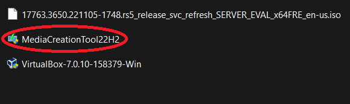
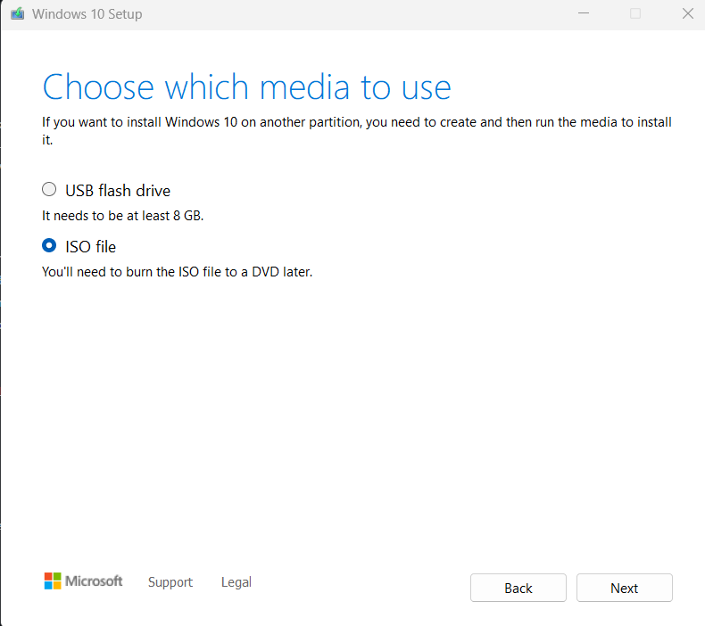

<h1>Basic Virtual Machine and Active Directory Home Lab Set up</h1>

<h2>Description</h2>
<b>I made this project to serve as a general walkthrough for people to set up Actice Directory, DNS, DHCP, NAT and RAS in an emulated enterprise setting!</b>

<h2>Utilities a& Services Used and Created</h2>
 - Powershell  
 - Server Manager 
 - Active Directory 
 - DNS 
 - DHCP 
 - NAT 
 - RAS 

<h2>Environments and Tools Used</h2>
 Oracle VM VirtualBox: https://www.virtualbox.org/wiki/Downloads 
 Microsoft Server 2019: https://www.microsoft.com/en-us/evalcenter/download-windows-server-2019 
 Microsoft Windows 10 ISO: https://www.microsoft.com/en-us/software-download/windows10 

<h2 align="center">Virtual Machine Setup Walkthrough</h2>

<b>For this setup, we will be using this network diagram:<b>

<b>and utilizing VMware to create virtual setup of a Windows Server 2019 connecting to and managing a Windows 10 client. To start, download the Oracle VM VirtualBox, Microsoft Server 2019 ISO, and Microsoft Windows 10 ISO from the links under "Environments and Tools Used</h2>.
 

 Note: to obtain the Windows 10 ISO file, it's usually a little trickier than simply downloading it. you must first download the Windows 10 Media Creation Tool from the provided link (often called: "MediaCreationTool22H2.exe"). 

 

 
<b>After running the Media Creation file, you will be presented with the option to Upgrade your Windows or create an installation media. Click on "create an installation media" option.</b>

Then click on "ISO file" to create your Windows 10 ISO image file.

Now you have all your files:

 

<b>Once we have installed all the ISO files installed, appointing the Windows 10 ISO to "SeperClientLab" and Windows 2019 Server ISO to "SeperServerLab" it should look a little something like this:<b>

<h2 align="center">Server Configuration Walkthrough</h2>

<b>We'll start off with setting up the Server first. Click on the Server's settings tab and navigate to "Adaptor 2". Click "Enable Network Adapter" and make it attached to the internal network "intnet" as shown below:</b>

<b>This creates an internal network to attach to the NAT network that's configured in Adapter 1. Now load the Server ISO image to boot the virtual server!</b>

<b>First order of business is to set up the internet by configuring the two network adapters. One is for the internal NIC and the other for the external so we'll have to configure them. Navigate to Network Settings and click on "Change adapter options."</b>

<b>Once there, you will have two network options. One will be the external and other for the internal networks but you will have to configure these as such.</b>

<b>Right click on one and click on "Properties." Then double click on "Internet Protocol Version 4 (TCP/IPv4)" to configure it as the internal network. Based on our Network Diagram, configure the IP address, Subnet mask, and DNS server address.</b>

<b>In this virtual environment, the Domain Controller will act as our default gateway, so we do not need to add a default gateway address. And for the DNS server, I assigned it to a loopback address so that it will ping itself.</b>

 Now, open Server Manager and click on "Add roles and features" 

and by following this short clip, install the Active Directory, DHCP, DNS, NAT, and RAS!

https://github.com/seperdan/Home-Lab/assets/54723844/99b0c875-6b03-4e0c-becf-9121d7f3abcb

<b>Once this is doen, we we will need to create a Domain to go with the Active Directory Domain Services (AD DS) we just set up.

